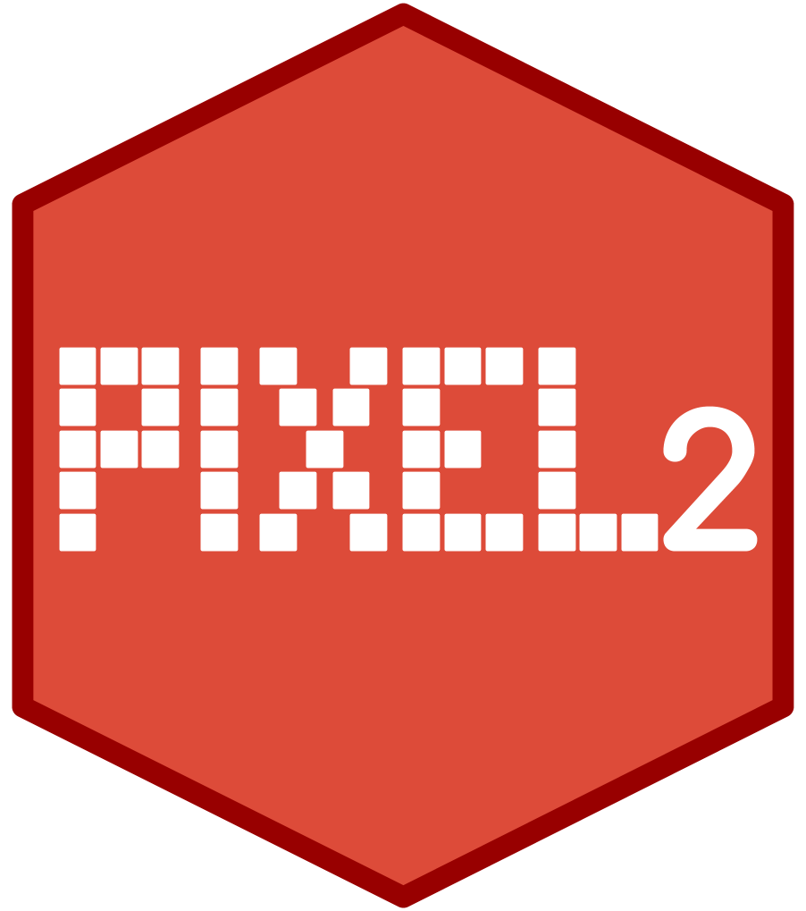

<p align="center"></p>

------

**Pixel2** is an original digital assistant to help people involved in a multi-omics biological project

[](https://doi.org/10.5281/zenodo.4028741)

## Requirements

We use Docker to develop and run Pixel. We invite you to ensure you have
installed the following requirements before trying to bootstrap the application:

* [Docker 1.12.6+](https://docs.docker.com/engine/installation/)

> We recommend you to follow Docker's official documentations to install
required docker tools (see links above).


**Docker must be on for the duration of Pixel2 use.**

## Quick start

Did you read the "Requirements" section above?

### PIXEL2 project installation

Download the zip file ([here](https://github.com/thomasdenecker/Pixel2/archive/master.zip)), extract this file and copy the obtained folder where you want on your computer. Note that if you move the folder, the installation procedure will have to be redone.

#### Windows installation

In this folder, you will find a file named INSTALLATION_WINDOWS.sh. By double clicking on it, the installation will begin. This may take a little time depending on the quality of your internet connection. When the installation will be completed, two new files will appear. They allow to launch the Pixel2.

#### Mac OsX installation

In this folder, you will find a file named INSTALLATION_MAC.sh. By double clicking on it, the installation will begin. This may take a little time depending on the quality of your internet connection. When the installation will be completed, two new files will appear. They allow to launch the Pixel2.

**NOTE**

You can also doucle click the file INSTALLATION_MAC_LINUX.sh. In this situation a small manipulation is required (1 time only).
In your Finder, right-click the file INSTALLATION_MAC_LINUX.sh and select "Open with" and then "Other...".

Here you can select the application you want the file to be execute with. In this case it should be the Terminal. To be able to select the Terminal, you have to switch from "Recommended Applications" to "All Applications"  (the Terminal.app application can be found in the Utilities folder).

Check "Always Open With" and after clicking OK you should be able to execute you SHELL script by simply double-clicking it.

#### Linux installation

**In command line**
```
cd PATH/TO/Pixel2/folder
./INSTALLATION_LINUX.sh
```

### Pixel2 utilisation
#### Windows & Mac OSX
Double click on PIXEL2 file and open your internet browser, typing the following url: http://localhost:3838/ and it should work™. Default user is admin with password : admin. We recommend you to change this password the first time you use it.

**NOTE** (MAC users) : You may need to repeat the same manipulation as for the installation file (only once).

#### Linux

Once the installation is complete, use this command to launch the application:
```
./Pixel2.sh
```
or
```
bash Pixel2.sh
```

## Development

### Launch in debug mode

During development, you will probably need to have the R outputs in the terminal. Passing through a docker, to have these outputs, you have to access the log file. The following command launches the application and has a log file that will be in the application folder. To help you in the choice of path of the application, you can look in the launch of the application.

```
docker run -ti --rm --link PIXEL2_DB:postgres -p 3839:3838 -v YOUR_APPLICATION_PATH:/srv/shiny-server -v YOUR_APPLICATION_PATH:/var/log/shiny-server tdenecker/pixel2_app R
```

### Connect to database with command line:  
```
docker run -it --rm --link PIXEL2_DB:postgres postgres psql -h postgres -U docker
```
The default password is docker. If you change this password, remember to make the change in the application code.

### Connect to a R session

```
docker run -ti --rm --link PIXEL2_DB:postgres -p 3839:3838 -v YOUR_APPLICATION_PATH:/srv/shiny-server tdenecker/pixel2_app R
```

**Warning**: nothing is saved in this session (package installation, ...)

## Citation
If you use Pixel2, please cite :

**Pixel: a digital lab assistant to integrate biological data in multi-omics projects**

Thomas Denecker, William Durand, Julien Maupetit, Charles Hebert, Jean-Michel Camadro, Pierre Poulain, Gaelle Lelandais

bioRxiv 427724; doi: https://doi.org/10.1101/427724

## Contributing

Please, see the [CONTRIBUTING](CONTRIBUTING.md) file.

## Contributor Code of Conduct

Please note that this project is released with a [Contributor Code of
Conduct](http://contributor-covenant.org/). By participating in this project you
agree to abide by its terms. See [CODE_OF_CONDUCT](CODE_OF_CONDUCT.md) file.

## License

Pixel2 is released under the BSD-3 License. See the bundled [LICENSE](LICENSE)
file for details.
